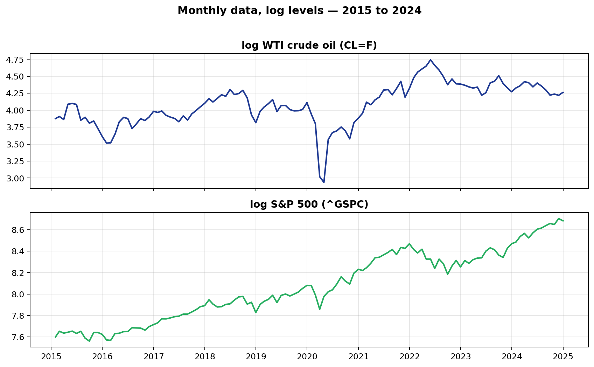
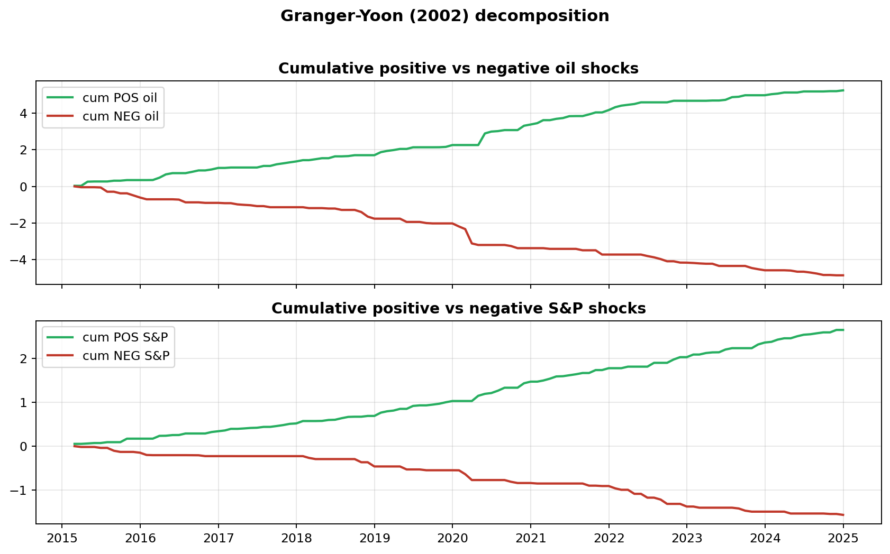
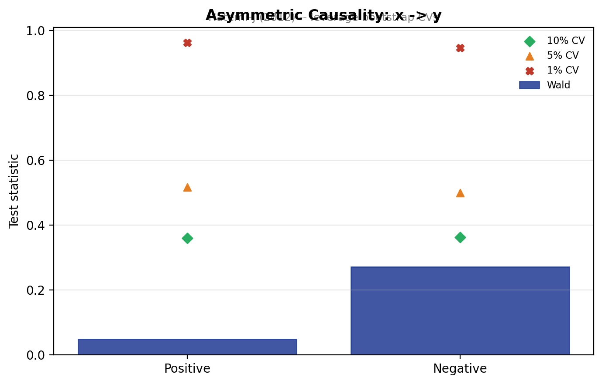
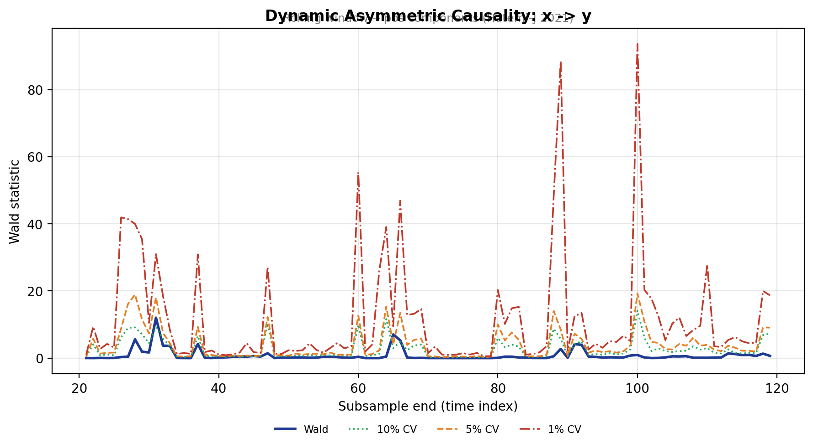
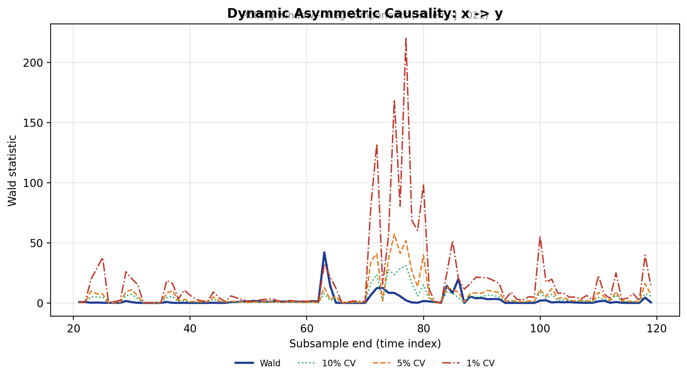
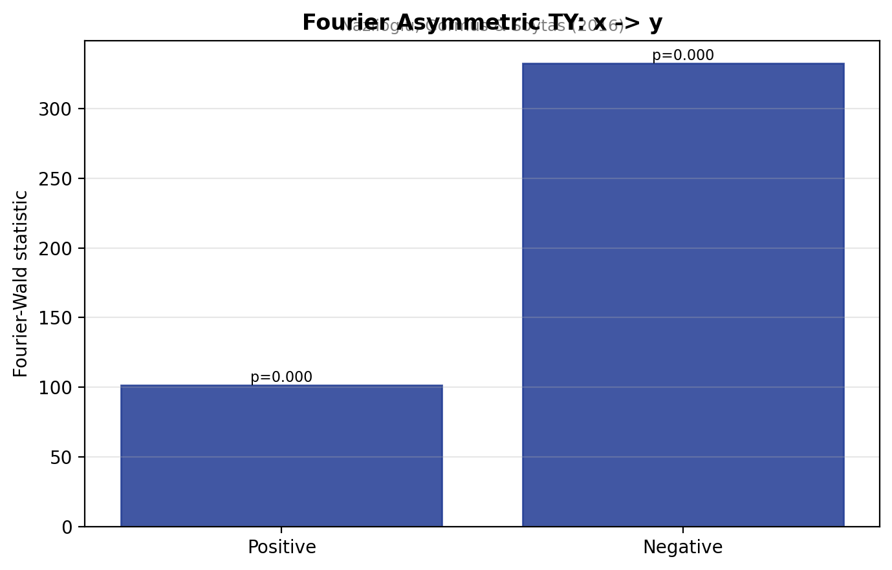
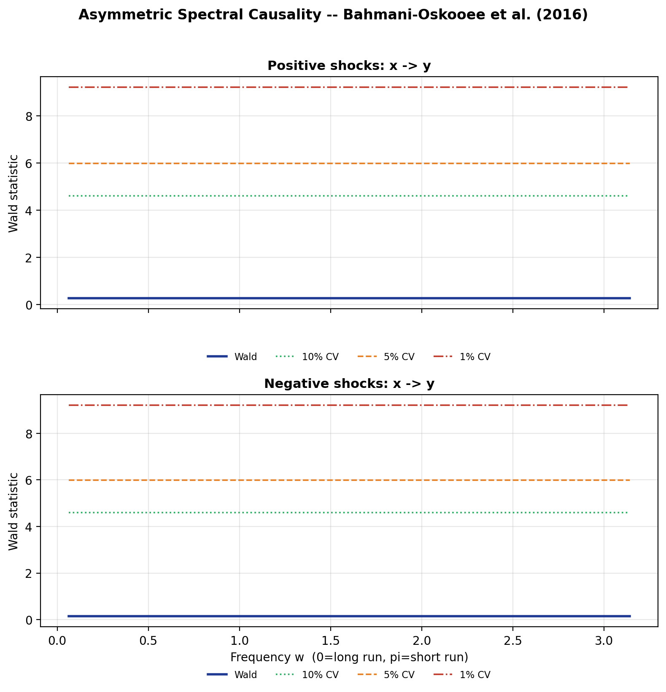
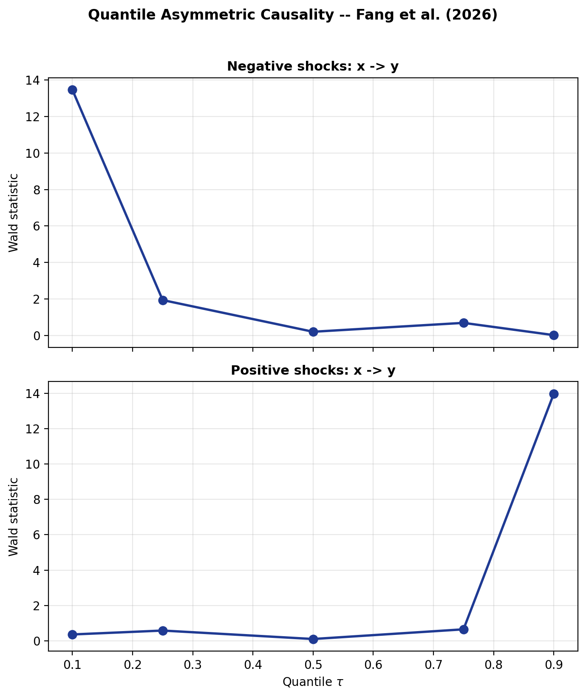
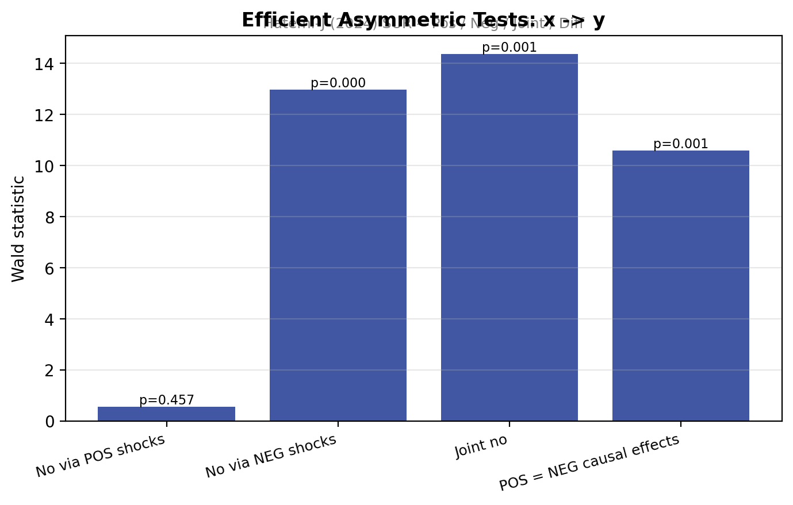

# asycaus &nbsp;<sub><sup>v 1.0.0</sup></sub>

**Asymmetric Granger-causality suite for Python and Stata.**

[](https://pypi.org/project/asycaus/)
[](https://github.com/merwanroudane/asycaus)
[](https://github.com/merwanroudane/asycaus)
[](https://github.com/merwanroudane/asycaus/blob/main/LICENSE)

> Author **Dr Merwan Roudane** &nbsp;·&nbsp; <merwanroudane920@gmail.com>
>
> Companion Stata package available on SSC: `ssc install asycaus`

---

## 0 · Quick links

- **Install (Python):** `pip install asycaus`
- **Install (Stata):**  `ssc install asycaus`
- **Source:** <https://github.com/merwanroudane/asycaus>
- **Executed notebook:** [full_demo.html](notebook/full_demo.html)
- **API reference:** [SYNTAX.md](https://github.com/merwanroudane/asycaus/blob/main/docs/SYNTAX.md)

---

## 1 · Theory in 5 minutes

### 1.1 Granger non-causality

Variable *x* does **not** Granger-cause variable *y* if the past of *x* does
not help predict *y* once the past of *y* is conditioned on. In a VAR(*p*):

$$
y_t = c + \sum_{r=1}^{p} a_{yy,r}\,y_{t-r} + \sum_{r=1}^{p} a_{yx,r}\,x_{t-r} + \varepsilon_{y,t}
$$

H<sub>0</sub>: *a*<sub>yx,1</sub> = ⋯ = *a*<sub>yx,p</sub> = 0.

The conventional Wald statistic asks whether **the sum of all causal effects**
is zero. This makes one strong assumption: positive and negative innovations
in *x* matter **identically** for *y*.

### 1.2 Why asymmetry matters

In financial markets, that assumption is almost always wrong:

- Investors react more strongly to bad news than good (loss aversion, Akerlof, Spence, Stiglitz).
- Asset-price floors at zero make pos/neg shocks structurally different.
- Sticky-price models give different cost pass-through up vs. down.

If we lump positive and negative shocks together, we **wash out** any asymmetry
and risk a false "no causality" conclusion when in fact one direction *is*
causal.

### 1.3 Granger and Yoon (2002) decomposition

Each variable is decomposed into the cumulative sum of its positive and
cumulative sum of its negative innovations:

$$
x_t^+ = \sum_{i=1}^{t} \max(\Delta x_i, 0), \qquad
x_t^- = \sum_{i=1}^{t} \min(\Delta x_i, 0).
$$

We then test for Granger causality **separately on each pair**:
*x*<sup>+</sup> → *y*<sup>+</sup> and *x*<sup>−</sup> → *y*<sup>−</sup>.

### 1.4 The seven tests in this package

| # | Test | Method paper |
|--|--|--|
| 1 | Static asymmetric + leverage bootstrap | Hatemi-J (2012); Hacker & Hatemi-J (2006, 2012) |
| 2 | Dynamic (rolling / recursive)          | Hatemi-J (2021) |
| 3 | Fourier-augmented asymmetric TY        | Nazlioglu et al. (2016); Pata (2020) |
| 4 | Frequency-domain (Breitung-Candelon) on Pos/Neg components | Bahmani-Oskooee, Chang & Ranjbar (2016) |
| 5 | Quantile asymmetric (+ Fourier)        | Fang, Wang, Shieh & Chung (2026) |
| 6 | Efficient SUR (Pos / Neg / Joint / Pos = Neg) | Hatemi-J (2024) |
| 7 | Unified battery + dashboard            | this package |

All seven share a single **HJC (Hatemi-J 2003) information criterion** for
lag selection by default, with AIC / AICC / SBC / HQC also available.

---

## 2 · Installation

### Python

```bash
pip install asycaus
# or from source:
pip install git+https://github.com/merwanroudane/asycaus.git
```

Requires Python ≥ 3.9. Dependencies (installed automatically): `numpy`,
`scipy`, `pandas`, `matplotlib`, `rich`.

### Stata

```stata
ssc install asycaus
help asycaus
```

Requires Stata ≥ 14.

---

## 3 · Practical example — oil and the S&P 500

The block below is the empirical study from the executed notebook
[(`full_demo.html`)](notebook/full_demo.html), which downloads daily WTI crude
and S&P 500 closes from Yahoo Finance, aggregates to monthly log levels and
runs every test in the library. Every figure on this page comes from that
notebook (see also [`docs/tables/`](https://github.com/merwanroudane/asycaus/tree/main/docs/tables) and [`docs/figures/`](https://github.com/merwanroudane/asycaus/tree/main/docs/figures)).

### 3.1 Data

```python
import yfinance as yf, numpy as np, asycaus

raw = yf.download(['CL=F', '^GSPC'], start='2015-01-01', end='2024-12-31',
                  progress=False, auto_adjust=True)['Close'].dropna()
monthly = raw.resample('M').last().apply(np.log).dropna()
y = monthly['^GSPC'].to_numpy()   # ln S&P 500
x = monthly['CL=F'].to_numpy()    # ln WTI crude oil
```



### 3.2 Cumulative pos / neg shocks

```python
Y = np.column_stack([y, x])
C_pos = asycaus.pos_neg_components(Y, positive=True)
C_neg = asycaus.pos_neg_components(Y, positive=False)
```



### 3.3 Static asymmetric — Hatemi-J (2012)

```python
asycaus.static(y, x, shock='both', max_lag=6, boot=500)
```



### 3.4 Dynamic asymmetric — Hatemi-J (2021)

```python
asycaus.dynamic(y, x, shock='pos', mode='rolling', max_lag=3, boot=120)
asycaus.dynamic(y, x, shock='neg', mode='rolling', max_lag=3, boot=120)
```





### 3.5 Fourier-augmented TY — Nazlioglu et al. (2016)

Smooth structural breaks (Covid-19 crash, 2022 Ukraine invasion, etc.) are
absorbed by sin/cos terms.

```python
asycaus.fourier(y, x, shock='both', kmax=4, form='single', max_lag=6)
```



### 3.6 Frequency-domain — Bahmani-Oskooee et al. (2016)

```python
asycaus.spectral(y, x, shock='both', nfreq=50, max_lag=6)
```



### 3.7 Quantile — Fang et al. (2026)

```python
asycaus.quantile(y, x, shock='both',
                 quantiles=(0.1, 0.25, 0.5, 0.75, 0.9),
                 max_lag=4, fourier=True, kmax=2)
```



### 3.8 Efficient SUR — Hatemi-J (2024)

The decisive test: does the **positive-shock causal coefficient differ from
the negative-shock causal coefficient**? Rejection ⇒ formal evidence of
asymmetric causation.

```python
asycaus.efficient(y, x, max_lag=6)
```



### 3.9 Unified summary

| Test | Shock | Statistic | p-value | Decision |
|---|---|---|---|---|
| Static (Hatemi-J 2012) | Pos | 0.048 | 0.826 | Fail to reject |
| Static (Hatemi-J 2012) | Neg | 0.271 | 0.603 | Fail to reject |
| Fourier (Nazlioglu 2016) | Pos | 101.52 | < 0.001 | **Reject** |
| Fourier (Nazlioglu 2016) | Neg | 332.32 | < 0.001 | **Reject** |
| Efficient Pos only (HJ 2024) | Pos | 0.554 | 0.457 | Fail to reject |
| Efficient Neg only (HJ 2024) | Neg | 12.962 | < 0.001 | **Reject** |
| Efficient Joint (HJ 2024) | both | 14.363 | 0.001 | **Reject** |
| **Efficient Pos = Neg (HJ 2024)** | **diff** | **10.575** | **0.001** | **Reject** |

The headline finding is the **Hatemi-J (2024) Pos = Neg test rejecting at the
1% level** (*W* = 10.575, *p* = 0.001) — formal evidence that crude-oil
shocks affect the S&P 500 asymmetrically over 2015–2024. Negative oil shocks
have a significant causal impact whereas positive ones do not, a finding that
the conventional symmetric Granger test cannot detect.

---

## 4 · Documented API

Every function has a one-line summary in the README and a full description in
[`docs/SYNTAX.md`](https://github.com/merwanroudane/asycaus/blob/main/docs/SYNTAX.md).

```python
import asycaus
asycaus.static    (y, x, ...)   # Hatemi-J (2012)
asycaus.dynamic   (y, x, ...)   # Hatemi-J (2021)
asycaus.fourier   (y, x, ...)   # Nazlioglu, Gormus & Soytas (2016)
asycaus.spectral  (y, x, ...)   # Bahmani-Oskooee, Chang & Ranjbar (2016)
asycaus.quantile  (y, x, ...)   # Fang, Wang, Shieh & Chung (2026)
asycaus.efficient (y, x, ...)   # Hatemi-J (2024)
asycaus.all_tests (y, x, ...)   # full battery
asycaus.pos_neg_components(Y, positive=True)   # Granger-Yoon (2002)
```

Each returns a `Result` dataclass with three things:

- `.table` — `pandas.DataFrame` of the numerical output
- `.print()` — re-render the boxed `rich` table
- `.plot(save="filename.png")` — re-render the publication-quality plot

---

## 5 · Companion Stata package

A 1-to-1 Stata twin of this library is available on SSC with the same name:

```stata
ssc install asycaus
help asycaus
asycaus static  dln_inv dln_inc, boot(500) shock(both)
asycaus dynamic dln_inv dln_inc, rolling boot(150)
asycaus all     dln_inv dln_inc, maxlag(4) boot(300)
```

The Stata version produces identical numerical output and analogous
publication-quality graphs.

---

## 6 · References

- Bahmani-Oskooee, M., Chang, T., & Ranjbar, O. (2016). Asymmetric causality using frequency-domain and time-frequency-domain (wavelet) approaches. *Economic Modelling*, **56**, 66–78.
- Breitung, J., & Candelon, B. (2006). Testing for short- and long-run causality. *Journal of Econometrics*, **132**, 363–378.
- Enders, W., & Lee, J. (2012). The flexible Fourier form and DF-type unit root tests. *Economics Letters*, **117(1)**, 196–199.
- Fang, H., Wang, C.-H., Shieh, J. C. P., & Chung, C.-P. (2026). The asymmetric Granger causality between banking-sector and stock-market development and economic growth in quantiles considering Fourier. *Applied Economics*, **58(20)**, 3822–3838.
- Granger, C. W. J., & Yoon, G. (2002). Hidden cointegration. *UCSD Discussion Paper* 2002-02.
- Hacker, R. S., & Hatemi-J, A. (2006). Tests for causality between integrated variables using asymptotic and bootstrap distributions. *Applied Economics*, **38(13)**, 1489–1500.
- Hacker, R. S., & Hatemi-J, A. (2012). A bootstrap test for causality with endogenous lag length choice. *Journal of Economic Studies*, **39(2)**, 144–160.
- Hatemi-J, A. (2003). A new method to choose optimal lag order in stable and unstable VAR models. *Applied Economics Letters*, **10(3)**, 135–137.
- Hatemi-J, A. (2012). Asymmetric causality tests with an application. *Empirical Economics*, **43**, 447–456.
- Hatemi-J, A. (2021). Dynamic Asymmetric Causality Tests with an Application. *arXiv* 2106.07612.
- Hatemi-J, A. (2024). Efficient Asymmetric Causality Tests. *arXiv* 2408.03137.
- Koenker, R. (2005). *Quantile Regression*. Cambridge University Press.
- Nazlioglu, S., Gormus, N. A., & Soytas, U. (2016). Oil prices and REITs: gradual-shift causality. *Energy Economics*, **60**, 168–175.
- Pata, U. K. (2020). How is COVID-19 affecting environmental pollution in US cities? Evidence from asymmetric Fourier causality test. *Air Quality, Atmosphere & Health*, **13**, 1149–1155.
- Phillips, P. C. B., Shi, S., & Yu, J. (2015). Testing for multiple bubbles. *International Economic Review*, **56(4)**, 1043–1078.
- Toda, H. Y., & Yamamoto, T. (1995). Statistical inference in vector autoregressions with possibly integrated processes. *Journal of Econometrics*, **66**, 225–250.

---

## 7 · Citation

```bibtex
@software{roudane2026asycaus,
  author = {Roudane, Merwan},
  title  = {asycaus: Asymmetric Granger-causality suite for Python and Stata},
  year   = {2026},
  url    = {https://github.com/merwanroudane/asycaus},
  version= {1.0.0}
}
```

---

<p align="center" style="color:#7f8c8d;font-size:0.9em;">
&copy; 2026 Dr Merwan Roudane &nbsp;·&nbsp; <a href="https://github.com/merwanroudane/asycaus">GitHub</a>
&nbsp;·&nbsp; <a href="https://pypi.org/project/asycaus/">PyPI</a>
&nbsp;·&nbsp; <a href="mailto:merwanroudane920@gmail.com">Email</a>
</p>
